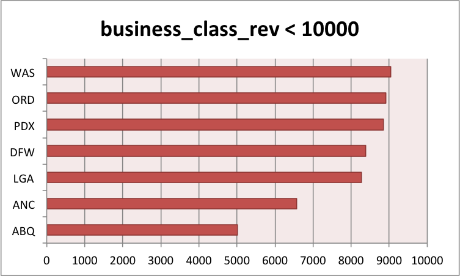

# ICA4
## Question 1
Which airport has the highest cargo revenue?

```sql
SELECT destination_airport, cargo_rev
FROM datasets.flight_revenue
ORDER BY cargo_rev DESC
```


## Question 2
Rank the first-class revenue from highest to lowest by airport

```sql
SELECT destination_airport, first_class_rev
FROM datasets.flight_revenue
ORDER BY first_class_rev DESC
```


## Question 3
Which airport has the lowest business-class revenue?

```sql
SELECT destination_airport, business_class_rev
FROM datasets.flight_revenue
ORDER BY business_class_rev ASC
```


## Question 4
Rank the coach's revenue from lowest to highest by airport

```sql
SELECT destination_airport, coach_rev
FROM datasets.flight_revenue
ORDER BY coach_rev ASC
```


## Question 5
Which airport has the business-class revenue below 10000?

```sql
SELECT destination_airport, business_class_rev
FROM datasets.flight_revenue
WHERE business_class_rev < 10000 
ORDER BY business_class_rev ASC
```

